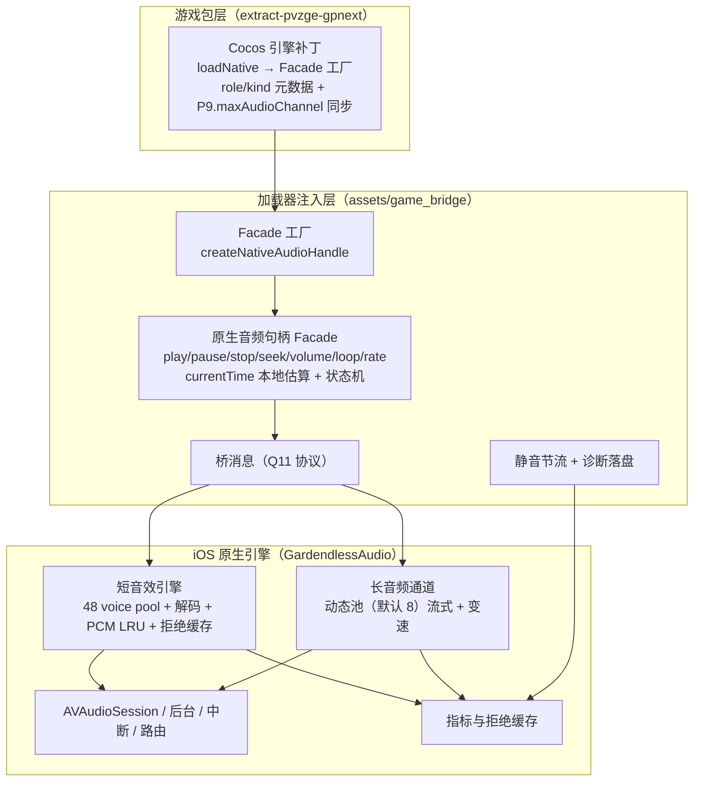

# 音频管线技术框架（目标架构 · 评审定稿 v2）

> 状态：定稿（2026-08-06，经 grilling 逐项确认 + 外部证据与游戏资源包复核修订；P0 代码已实现，待 iPad 实机验收）
> 范围：iOS WebView 游戏音频重构；Android / OHOS 原生层不改。
> 目标：消除 iOS WebView 游戏中高密度短音效带来的可感知卡顿，同时保证 BGM/环境音不丢。

## 0. 评审结论摘要（相对 v1 的关键变更）

| # | 决策 | 结论 |
| --- | --- | --- |
| 1 | 捕获架构 | 游戏包补丁直接返回**原生音频句柄（Facade）**，iOS 上不再创建真实 `<audio>` 元素；加载器层提供 Facade 工厂 + 桥 + 节流 + 诊断 |
| 2 | 覆盖范围 | iOS 所有被 Facade 捕获的音频（短音效 + BGM/环境音/长音频）都走原生；原生不支持的容器会静音并结束，不转交 WebKit；只有 Facade 工厂不可用时才保留旧游戏包兼容路径 |
| 3 | 状态语义 | `currentTime` 由 JS 本地估算，原生只在权威时刻回传 `ended/silent/stopped`；不做周期性位置推送 |
| 4 | 并发口径 | voice pool 与 `P9.maxAudioChannel` 绑定为同一常量（初始 48）；池满丢**最旧** one-shot 并回 `ended`；不抢占长音频；删除 `priority` 字段 |
| 5 | 长音频 | 动态长音频池（默认 8 路上限、可配置），与短音效池隔离、永不抢占；流式调度，满时拒绝并回 `ended` |
| 6 | 长短判定 | **角色优先**（oneShot / continuous），可选 `kind`；continuous 且非 loop 且 ≤10s/≤256KB 的 AudioSource 短音频细化路由到短音效引擎；拒绝缓存 key = URL + etag + role；扩展名/关键字仅兜底 |
| 7 | 拒绝语义 | `ended`=自然播完/被抢占；`silent`=本次不播并照发一次 `ended`；JS 侧按 URL 静音节流（10s 内 3 次后窗口内不再发 play），计数 `silentThrottled` |
| 8 | 变速 | 长通道原生支持 playbackRate（`AVAudioUnitVarispeed` 0.25–4，`preservesPitch=false` 与 DOM 一致）；短音效划 4–8 路可变速子池；原生拒绝结果统一静音，不转交 WebKit |
| 9 | 音量 | Facade `volume` setter 实时发 `setVolume`；保留 `setMasterVolume` 作为全局乘数 |
| 10 | 生命周期 | 中断/路由/后台时原生批量回传 `stopped`，Facade 复位并派发 `ended`，恢复后由游戏重新 `play()` 触发引擎重启 |
| 11 | 协议 | 命令集按 §3 定稿：`play/pause/stop/seek/setVolume/setLoop/setRate/release/setMasterVolume/writeDiagnostics` + 批量 `ended/silent/stopped` |
| 12 | 合并 | **删除**播放级“同 URL ≤50ms 合并”；只保留在途解码合并 |
| 13 | 验收 | 诊断 `schemaVersion=2`，验收 1–6 见 §9；**P0 完成 = 验收 1、2、3、6 通过** |

## 1. 设计目标（全部可度量）

| 维度 | 目标 |
| --- | --- |
| 帧稳定性 | 音频突发期间 rAF 无 >100ms 间隔；p99 帧耗时 ≤20ms；无可归因于音频的主线程长任务（>50ms） |
| 短音效容量 | 并发短音效 48 路（与游戏 `P9.maxAudioChannel` 同常量，实测校准）；持续触发 ≥300 次/秒；缓存命中调度 <10ms；首次解码不承诺固定硬上限，用有界队列 + 预热 + 同 URL 解码合并保障 |
| 不丢声 | music/ambience/continuous 类音频不允许 silent；短音效允许按规则丢弃（丢最旧 one-shot） |
| 变速 | BGM 原生支持 0.1–4 倍速（覆盖用户设置 `MusicSpeedRange` 0.5–2 与关卡倍率组合） |
| 可观测 | 每次请求、决策、拒绝都有计数器与时间戳，JS+原生共享时间轴，可导出统一 JSON（schemaVersion 2） |

## 2. 分层与职责

### 游戏包层

- 只做版本敏感的事：Cocos 引擎补丁、音频默认值、把“one-shot / continuous / music / ambience”的语义暴露到稳定契约上。
- `loadNative()` 不再 `document.createElement("audio")`，改为调用加载器注入的 `createNativeAudioHandle(url, { role, kind })`；无 Facade 工厂时回退真实元素 + 旧代理（兼容未打补丁的旧游戏包）。
- `P9.maxAudioChannel` 与原生 voice pool 绑定为同一常量，避免两个并发管理器口径分裂。
- 每次游戏升级由 action 自动重放补丁，layout 变化时显式失败（沿用现有 `PatchError` 断言）。
- 不承载设备策略（内存预算、并发数、丢音策略），这些属于加载器/原生。

### 加载器注入层

- 提供 `createNativeAudioHandle(url, { role, kind })`：返回实现 Cocos DOM 包装类所需成员集的普通 JS 对象，不再产生 WebKit 媒体元素。
- Facade 实现 Cocos 实际依赖的成员：`play()→Promise / pause() / src / volume / loop / playbackRate / preservesPitch / currentTime（读+写）/ duration / add-removeEventListener("ended")`。
- `currentTime` 用本地时钟估算（`startedAt/duration/rate/loop/pausedAt`），原生 `ended/silent/stopped` 作为权威事件复位状态。
- 按 URL 做静音节流：同一 URL 窗口内连续 silent（10s 内 3 次）后不再发 play，仍照发 `ended`，计数 `silentThrottled`。
- 不做重逻辑；所有容量决策交给原生引擎。
- 诊断计数与 JSON 落盘（schemaVersion 2）。

### 原生引擎层

- 短音效引擎：48 路 voice pool、有界并发解码、PCM LRU、拒绝缓存、丢最旧抢占、4–8 路可变速子池。
- 长音频通道：动态池（默认 8 路），流式调度，不参与抢占和丢弃；支持 `loop/volume/seek/pause/resume/playbackRate`。
- 生命周期：中断/路由/后台统一回传 `stopped` 批量事件。
- 指标：每次 admitted/preempted/silent/rejected-cached/queue-depth/pool-occupancy/long-active/stopped-reason 可计数。

## 3. 核心接口契约（JS ↔ 原生）

消息版本化，`schemaVersion` 固定；未知字段忽略，未知命令拒绝。

| 方向 | 命令 | 关键字段 | 语义 |
| --- | --- | --- | --- |
| JS → 原生 | `play` | `requestId, url, role(oneShot/continuous), kind?(music/ambience), volume, loop, rate, startTime?` | 已存在且暂停 → 续播；否则从头或 `startTime` 播放；已播中再次 play → 按 Cocos 语义先停再播 |
| JS → 原生 | `pause` | `requestId` | 保持位置暂停（长音频必需） |
| JS → 原生 | `stop` | `requestId` | 停止并归零（对应 Cocos `stop()`） |
| JS → 原生 | `seek` | `requestId, time` | 移动位置；播放中即时生效 |
| JS → 原生 | `setVolume` | `requestId, volume` | 播放中/播放前都即时生效 |
| JS → 原生 | `setLoop` | `requestId, loop` | 播放中切换循环（Cocos 常在 play 后设 loop） |
| JS → 原生 | `setRate` | `requestId, rate` | 播放中变速（BGM 速度滑杆/关卡倍率） |
| JS → 原生 | `release` | `requestId` | Facade 销毁/换 clip 时释放原生资源并停声 |
| JS → 原生 | `setMasterVolume` | `volume` | 全局乘数（游戏不用，保留给加载器 UI） |
| JS → 原生 | `writeDiagnostics` | `json` | 沿用 |
| 原生 → JS | `ended` | `requestIds[], reasons[]` | 自然播完 / 短音效被抢占 |
| 原生 → JS | `silent` | `requestIds[], reasons[]` | 拒绝/解码失败/池满 |
| 原生 → JS | `stopped` | `requestIds[], reason` | 中断/路由变化/后台 |

已删除：`register`（Facade 取代后没有意义）、`priority`（游戏无优先级来源）。`ended/silent/stopped` 按帧合并，一次 `evaluateJavaScript` 传数组，避免逐条桥调用。

## 4. 分类与路由策略

判断顺序（前序通过则不再走启发式）：

1. `role=continuous` 或 `kind=music/ambience` → 长音频通道。
2. `role=continuous` 且非 loop 且文件 ≤10s / ≤256KB（AudioSource 播放的短音效）→ 短音效引擎。
3. `role=oneShot` 且 `rate=1` → 短音效引擎。
4. `role=oneShot` 且 `rate≠1` → 短音效可变速子池。
5. 拒绝缓存命中（URL + etag + role）→ 直接按缓存结论处理，不再解码。
6. 不支持容器 → 原生回传 `silent`，Facade 派发一次 `ended` 并参与 URL 静音节流，不转交 WebKit。
7. 未识别路径（未打补丁的旧游戏包）→ 扩展名/路径关键字兜底。

| 音频特征 | 去向 | 是否允许丢 |
| --- | --- | --- |
| continuous / music / ambience | 长音频通道 | 不允许 |
| one-shot，rate=1 | 原生短音效引擎 | 允许（丢最旧 one-shot） |
| one-shot，rate≠1 | 短音效可变速子池 | 允许（丢最旧 one-shot） |
| 不支持容器 | 静音并派发 `ended` | 允许拒绝，不允许悬挂状态机 |

**不做播放级同 URL 合并**：游戏 `SoundRescourses` 已做一帧内同 clip 去重与冷却节流，原生再合并会改变多声部手感。只保留“同一 URL 在途解码合并”（共享一次解码，解码完成后各自入池播放）。

## 5. 原生短音效引擎设计

- **Voice pool**：48 路（与 `P9.maxAudioChannel` 同一常量，可配置），其中 4–8 路挂 `AVAudioUnitVarispeed` 组成可变速子池（`preservesPitch=false`，与 Cocos DOM 行为一致）。
- **准入策略**：池满时抢占**最旧** one-shot（向其回 `ended`），不抢占长音频通道；新请求照常入池。
- **解码**：有界并发（2–4），同一 URL 在途请求共享一次解码；解码结果进 PCM LRU（96MB，单 buffer ≤4MB）。
- **拒绝缓存**：`duration_limit`/`compressed_size_limit`/`unsupported_container` 等结论按 URL + etag + role 缓存，后续请求直接复用，不重复解码。
- **预热**：对高频短音效在首次使用前提前解码/缓存（由使用频率统计驱动）。
- **事件回传批量**：原生 → JS 的 `ended/silent/stopped` 按帧合并传数组。
- **延迟**：缓存命中直接调度；首次解码走有界队列，超时或队满按规则丢最旧 one-shot。
- **音量**：每个 request 独立音量，`setVolume` 实时更新；`setMasterVolume` 作为全局乘数。

## 6. 长音频/BGM 通道

- **动态池**：默认 8 路上限（可配置），与短音效池完全隔离，永不参与抢占；池满时拒绝新请求并回 `ended`。
- **流式调度**：`AVAudioFile` 流式播放，不整段进 PCM LRU；支持 `loop / volume / seek / pause / resume / playbackRate`（varispeed 0.25–4；游戏 0.1–0.25 的低速值会被钳到 0.25，实际出现极少）。
- 覆盖游戏实际场景：双播放器轮换（`audioSource` / `audioSourceReplay`）、插入音乐、钢琴/节日双速、禅境花园环境音、`loopAudioLong`（loop=true）。
- 游戏通过轮询 `currentTime` 决定切歌/归零（`changeLoopPlayer`、`musicLength`、`currentTime=0`），Facade 的本地估算精度足够（容差 0.3–0.5s）。

## 7. 会话与生命周期

- 原生发生 `interruptionBegan / routeChanged / didEnterBackground / engineRestart` 时，**批量回传 `stopped`**（复用批量通道）。
- Facade 收到后：本地估算复位，统一派发 `ended`（游戏按自身逻辑恢复/重播）。
- 恢复前台/中断结束后，游戏重新 `play()` 触发原生 `ensureEngineRunning` 重启；原生**不自动恢复** voice。
- 现有 `SfxExceptionGuard` 保留，engine start/schedule 异常不崩溃、有指标。

## 8. Facade 状态语义（补充细节）

- `play()` 必须返回 resolved Promise（Cocos `p9` 把 promise reject 当成需要用户手势重试，Facade 永远不 reject）。
- `ended` 事件语义与 Cocos `_onEnded` 对齐：`seek(0) + state=INIT + emit(ENDED)`。
- `stop` 由 Facade 本地归零并发 `stop`；`destroy()` 发 `release` 停掉原生 voice（Cocos destroy 本身不 stop，必须补）。
- `volume` setter 每次变化发 `setVolume`；`playbackRate` setter 发 `setRate`（长通道即时变速；短音效仅在可变速子池上生效，其余 voice 维持原速）。
- `silent` 仍派发一次 `ended` 保持 Cocos 状态机不悬挂，但按 URL 节流后续 play。
- `getPCMData/getSampleRate` 可 no-op（游戏代码无真实调用）。

## 9. 诊断与验收

沿用 `audio_diagnostics.json` + 原生 LogStore，`schemaVersion=2`，JS 与原生事件共享时间轴。

### JS 侧计数器

- `facadeCreated`（替代 `lazySrcSet` 作为创建计数；iOS 补丁游戏期望 ≈ 0 真实元素）
- `playPosted / pausePosted / stopPosted / seekPosted / setVolumePosted / releasePosted`
- `endedReceived / silentReceived / stoppedReceived`
- `silentThrottled`
- `webkitFallback`（期望 ≈ 0）
- rAF 间隔 >100ms、p95/最大帧耗时（沿用）

### 原生侧计数器

- 短音效：`admitted / preempted / dropped / rejectedCached / rejectedLimits / decodeStarted / decodeFinished / decodeMerged / queueDepth / poolOccupancy`
- 长通道：`longChannelActive / longChannelSilent / longPoolOccupancy / seekCount / pauseResumeCount`
- 生命周期：`interruptionBegan / routeChanged / backgroundStopped / foregroundRestarted / engineStartFailed / scheduleException`

### 验收场景（iPad 实机）

1. **3 秒环境音重试周期消失**：ambience 走长通道真正发声，诊断中无重复 silent、无归因于它的 rAF 长帧。
2. **WorldMap BGM 可听见**：`MusicSpeedRange` 0.5–2、极限 0.1–4 变速、暂停/恢复/seek、音量淡入淡出都正常。
3. **爆发短音效场景**：rAF 无 >100ms 间隔、p99 ≤20ms、无长任务；33 路以上并发时丢最旧而非丢新。
4. **中断/路由**：来电/拔耳机按 §7 回传 `stopped`，恢复后 BGM 能重新发声。
5. **拒绝节流生效**：同一 URL 连续 silent 后 `silentThrottled` 增长、窗口内不再发 `play`。
6. **真实元素清零**：补丁后 `lazySrcSet=0`，`webkitFallback≈0`。

## 10. 改动边界

| 能力 | 加载器侧 | 游戏包侧 | 原生 iOS |
| --- | --- | --- | --- |
| Facade 工厂 / 桥 / 节流 / 诊断 v2 | ✅ | 消费 | ❌ |
| Facade 返回（替代真实元素）、role/kind 元数据、`P9.maxAudioChannel` 同步 | ❌ | ✅ | ❌ |
| 短音效 voice pool / 拒绝缓存 / 解码并发 / 变速子池 | ❌ | ❌ | ✅ |
| 长音频动态池 / 流式 / 变速 / 生命周期 | ❌ | ❌ | ✅ |
| 音频转码（格式/采样率） | ❌ | ✅ | ❌ |

## 11. 落地顺序

- **P0**：Facade 工厂与桥协议（Q11）+ 长音频原生流式 + 拒绝缓存 + 批量事件 + 生命周期同步（Q10）+ `setVolume/seek/pause/release` + 静音节流（Q7）+ 移除 register 洪水 + 诊断 v2。
  **P0 完成 = 验收 1、2、3、6 通过。**
- **P1**：48 路 voice pool 与丢最旧抢占 + 4–8 路可变速子池 + 有界并发解码（2–4）+ 预热 + 并发/内存校准；验收 4、5 在此阶段回归确认。
- **P2**：长音频池上限校准 + 诊断指标补全 + 全量性能验收。

## 12. 非目标

- 不改 Android / OHOS 原生层。
- 不改游戏玩法与音量语义。
- 不引入第三方依赖。
- 不做无证据的“现代化”改造；每一步以测量数据验收。
- 不做 WebAudio 捕获：补丁已强制 DOM 加载路径，设置里的 WebAudio/DOM 切换实际无效，维持现状。
- 不做播放级同 URL 合并（§4）。

## 13. 外部依据（2026-08-06 复核）

### 已核实的 WebKit / Cocos 证据

- WebKit Bug 184015（`evaluateJavaScript` 约每秒一次 12–16ms 固定成本）：https://wiki.webkit.org/show_bug.cgi?id=184015
- WebKit Bug 220226（大量 `<audio>` 元素阻塞 WebContent 主线程）：https://wiki.webkit.org/show_bug.cgi?id=220226
- WebKit Bug 190552（WKWebView WebAudio 渲染与 UI/DOM 线程耦合）：https://wiki.webkit.org/show_bug.cgi?id=190552
- WebKit Bug 319262（媒体元素触发 O(n²) Now Playing 扫描，2026-07）：https://wiki.webkit.org/show_bug.cgi?id=319262
- WebKit Bug 221654（`evaluateJavaScript` IPC 往返昂贵）：https://wiki.webkit.org/show_bug.cgi?id=221654
- Cocos Creator 4.0 音频兼容性（iOS DOM Audio 音量不生效）：https://docs.cocos.com/creator/4.0/manual/zh/audio-system/audioLimit.html
- Cocos 声音系统总览（playOneShot / ended 语义）：https://docs.cocos.com/creator3d/manual/zh/audio-system/overview.html
- Apple Developer Forums 763750（AVAudioPlayer 预初始化/缓存、多音效用 AVAudioEngine + PlayerNode；页面反爬，结论来自检索摘要）：https://developer.apple.com/forums/thread/763750
- Stack Overflow 61470138 / 63492707（单 AVAudioEngine + PlayerNode 连接/断开优于多个 AVAudioPlayer；原页面 403，结论来自检索摘要）：https://stackoverflow.com/questions/61470138/ https://stackoverflow.com/questions/63492707/

### 游戏资源包与代码证据（pvzge-gpnext-0.12.1.zip，2026-08-06 审计）

- 4077 个音频全部为 `.mp3`（转码后为 M4A 容器），总量 56.9MB，最大 0.6MB，仅 34 个 >256KB。
- `P9.maxAudioChannel = 48`，Cocos 已有 `discardOnePlayingIfNeeded()`（总数达标时 stop 最旧 one-shot）。
- Cocos DOM 包装类只依赖约 10 个成员（play/pause/volume/loop/playbackRate/currentTime/duration/src/preservesPitch/ended 事件），Facade 可行。
- `SoundRescourses` 已做一帧内同 clip 去重（合并音量）与冷却节流，故不做播放级合并。
- BGM 使用双播放器轮换 + 轮询 `currentTime` + seek；`MusicSpeedRange` 0.5–2、极限 0.1–4，变速为原生必需能力。
- 26.1s 环境音（超 10s duration_limit）与 123.9s BGM（超 256KB size_limit）是被 silent 的真实对象，角色优先分类后可进长通道。

## 14. 保留 MP3（不转码）的校准建议（2026-08-06 审计）

审计脚本位于配套工具仓库的 `scripts/audit_audio_assets.py`，不属于本仓库交付文件。

对未转码原始包 `pvzge_web-0.10.0.zip`（4050 个 MP3，324.1MB，最大 4.5MB）全量探测（afinfo，全部可读）：

| 指标 | 数值 |
| --- | --- |
| 时长分布 | ≤1s: 1438 / 1–3s: 1867 / 3–10s: 536 / 10–30s: 101 / >30s: 108 |
| 大小分布 | >256KB: 155 / >384KB: 132 / >512KB: 120 / >1MB: 49 |
| 当前 256KB/10s 规则 | short_candidate 3830、size_over 11、long_candidate 209 |
| 384KB/10s 规则 | short_candidate 3841、size_over 0、long_candidate 209 |
| PCM 估算总量 | 4281MB；短音效池 963.2MB（中位 0.15MB、p90 0.47MB）；单 buffer 超 4MB 的文件 150 个（基本都 >11.6s，归长通道） |
| 百分位 | 时长 p50 1.37s / p90 4.5s / p99 67.4s / max 186.6s；大小 p50 31KB / p90 115KB / p99 1.3MB / max 4.5MB |

结论与建议：

1. **真 MP3 全链路可用**（容器检测、原生 AVAudioFile、资源 MIME 均已支持），不需要为“不转码”改解码代码。
2. **`compressedSfxByteLimit` 已定为 512KB（524288）**：256KB 会让 11 个 ≤10s 的短音效被静音；384KB 即可归零，512KB 为未来版本留余量。
3. **长通道限制保持 600s / 64MB 即可**：原始包最大 186.6s、4.5MB，远低于上限。
4. **`pcmCacheByteLimit` 已定为 96MB（100663296）**：原始包短音效中位 PCM 0.15MB，96MB 可驻留约 600 个典型短音效（p90 约 200 个），远大于单屏活跃音效集合；若 iPad 实测仍出现热音效反复 `decodeStarted`、`native_sfx_cache_hit` 占比低，再上调并重测。
5. **解码成本上升**：原始 MP3 多为 44.1kHz 立体声，解码采样量约为转码 16kHz 单声道的 5.5 倍；首发延迟和 CPU 峰值更高，`audioQueueConcurrency` 在原始包上建议先用 1–2 再实测。
6. **运行时可用 UserDefaults 覆盖而不改代码**：`audioCompressedSfxByteLimit`、`audioPcmCacheByteLimit`、`audioSingleBufferByteLimit`、`audioMaximumSfxDuration`、`audioLongMaxBytes`、`audioLongMaxDuration`。
