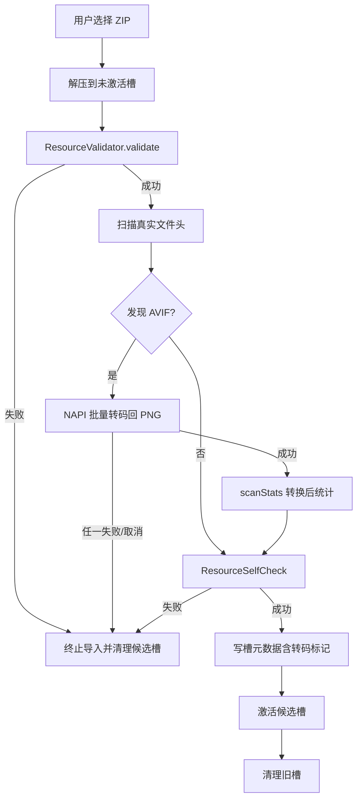

# GardendlessLoader 鸿蒙 AVIF 原地转码设计（v1 修订稿）

> 状态：设计方案修订稿，尚未实施  
> 修订日期：2026-08-07  
> 适用范围：`Dey410/GardendlessLoader`，HarmonyOS / OpenHarmony，兼容基线 API 12  
> 取代：`/Users/xiaozhu_410/Downloads/GardendlessLoader_AVIF_Compatibility_Cache_Design.md`（草稿，未实施）

---

## 1. 背景与问题

上游 PvZGE 发布管线会把 PNG 转成 AVIF 来压缩体积，但保留原始 `.png` 路径。以
`pvzge-gpnext-0.12.1.zip` 为例：

- `reports/transcode-summary.txt` 记录：607 张 PNG → AVIF，782,991,907 → 82,455,685
  字节（10.53%），avifenc 1.0.4，color q60 / alpha q80。
- 转换产物位于 `assets/resources/native/xx/<uuid>.png`，真实文件头为 `ftyp avif`
  （兼容品牌 `avif / mif1 / miaf / MA1A`），607 个文件合计约 78.6 MB。
- 语料审计结论：全部静态（无 moov/AVIS）、8-bit、标准 SDR
  （`nclx`：BT.709 原色 / sRGB 传递函数 / BT.601 矩阵 / full range）、无旋转/镜像/裁剪；
  597 张带 alpha，10 张不带；2 张 monochrome；73 张 ≥4096×4096。

### 1.1 运行路径与现状

鸿蒙运行路径不是 Flutter WebView，而是独立的原生 ArkWeb `GameAbility`：

- `GamePage.ets` 创建 ArkWeb，并在页面加载前安装自定义 `WebSchemeHandler`；
- `NativeGameResourceHandler.ets` 接管 `https://gardendless.invalid/...` 下的本地资源请求。

当前处理器只做 MIME 修正：检测文件头为 AVIF 时，即使扩展名是 `.png` / `.jpg` /
`.webp`，也返回 `image/avif`，然后把原始 AVIF 字节直接交给 ArkWeb。这能纠正协议 MIME，
但不能为 ArkWeb 增加 AVIF 解码能力，因此需要应用自带解码器。

项目当前兼容基线为 `compatibleSdkVersion: "5.0.0(12)"`。OpenHarmony Image Kit 的
AVIF/AVIS 解码从 API 26 才开始加入，当前目标版本不能依赖系统 Image Kit 转码。

### 1.2 为什么 ArkWeb 解不了 AVIF

API 12 时代的 ArkWeb（Chromium M114）在 OpenHarmony 构建中默认关闭
`enable_dav1d_decoder` / `enable_av1_decoder`，libavif 未编入任何 AV1 解码器，无法解码
AVIF；Image Kit 的 AVIF/AVIS 解码从 API 26 才开始加入，不能作为 API 12 的基础能力。
本问题已在 API 12 真机上复现：ArkWeb 收到 `image/avif` 后图片无法显示。

## 2. 方案结论

在导入候选槽时，把所有“真实文件头为 AVIF”的文件**原地转码回 PNG**，覆盖候选槽内同名
文件。不建立兼容缓存目录，不修改网页 URL，不修改游戏代码，不在游戏运行期解码。

固定边界：

- 输出：8-bit RGBA/RGB PNG，保留 alpha，标准 sRGB，去掉多余元数据。
- 只支持静态 AVIF；检测到动画/AVIS、HDR/高位深、超限文件时按严格失败处理。
- v1 只处理新导入；旧活动槽检测到 AVIF 时提示重新导入，不做自动迁移。
- 转码属于导入事务的强制阶段：任一失败即整体失败，当前活动槽保持不变。
- v1 不做设备能力探测（一律转换），不输出 WebP。

### 与“兼容缓存”方案对比

原地转码删除了缓存方案中的以下子系统：

- `.gardendless-cache/` 目录、manifest/index.json、URL→缓存映射；
- 处理器索引加载、缓存缺失/损坏语义、内部目录 403 规则；
- 缓存版本管理、旧槽迁移、ETag/Range 的缓存文件分支。

收益：

- 存储更小：缓存方案是 AVIF + PNG 双份；原地方案只有 PNG 一份。
- 候选槽本身就是 staging：失败/取消时现有 `_resetDirectory` 清空候选槽，不存在“原文件
  被污染”的原子性问题；用户的原始 zip 完全不动。
- 处理器只需删除 AVIF 嗅探分支：`.png` 路径 + PNG 内容，按扩展名天然返回 `image/png`。

## 3. 总体流程



## 4. 与现有导入事务的结合

新顺序：

```text
1. ResourceValidator.validate(candidateSlot)      // 在原始 AVIF 内容上做指纹/结构检查
2. ImageCompatibilityPreprocessor.scan(candidateSlot)  // 单遍扫描 + 嗅探
3. ImageCompatibilityPreprocessor.convert(candidateSlot) // NAPI 批量转码，并发 1
4. ResourceValidator.scanStats(candidateSlot)     // 转换后的真实统计
5. ResourceSelfCheck.validate(candidateSlot)
6. 读取游戏版本并写槽元数据（含 avifPngTranscode 标记）
7. 激活候选槽
8. 清理旧槽
```

要点：

- `validate()` 必须先于转码执行，保证指纹检查基于原始内容。
- `scanStats()` 必须后于转码执行，否则 `fileCount`/`totalBytes` 记录的是 AVIF 尺寸。
  由于没有内部缓存目录，无需修改 `scanStats()` 的排除逻辑。
- 转码失败/取消时，候选槽按现有失败流程清理；不允许“部分转换后继续激活”。

## 5. 原生转码模块设计

### 5.1 工程边界

当前 `ohos/entry` 没有 C++ 构建层，需要新增：

```text
ohos/entry/src/main/cpp/
├─ CMakeLists.txt
├─ napi/
│  ├─ avif_transcode_napi.cpp
│  └─ avif_transcode_napi.h
├─ core/
│  ├─ avif_to_png.cpp
│  ├─ avif_to_png.h
│  ├─ path_guard.cpp
│  └─ path_guard.h
└─ third_party/
   ├─ libavif/
   ├─ dav1d/            # 或 libaom
   ├─ libpng/
   └─ zlib/
```

`ohos/entry/build-profile.json5` 增加：

```json5
"buildOption": {
  "externalNativeOptions": {
    "path": "./src/main/cpp/CMakeLists.txt",
    "arguments": "",
    "cppFlags": "-std=c++17",
    "abiFilters": ["arm64-v8a"]
  }
}
```

优先复用 OpenHarmony-SIG `tpc_c_cplusplus` 中的 libavif/libaom/libpng 构建脚本
（`./build.sh libavif`），固定上游版本或 commit；CI 从可审计源码构建，不使用来源不明的
预编译 `.so`。

### 5.2 NAPI 接口

不要通过 MethodChannel/NAPI 传递 RGBA 大缓冲区。接口只传路径和参数，原生层从文件读取
AVIF，直接把 PNG 写入输出文件：

```ts
interface AvifTranscodeRequest {
  operationId: string;
  resourceRoot: string;
  relativePaths: string[];
  limits: {
    maxInputBytes: number;
    maxWidth: number;
    maxHeight: number;
    maxPixels: number;
    maxFrames: number;
  };
}

interface AvifTranscodeItemResult {
  relativePath: string;
  outputSize: number;
  width: number;
  height: number;
  hasAlpha: boolean;
}

interface AvifTranscodeResult {
  converted: AvifTranscodeItemResult[];
}
```

返回 `Promise<AvifTranscodeResult>`，转码在 native worker 线程执行，不占用 ArkUI 主线程。

### 5.3 Dart 到 ArkTS 的桥接

新增平台抽象：

```text
lib/src/services/image_compatibility_preprocessor.dart
```

- 定义平台无关接口；Android/iOS 默认 no-op。
- HarmonyOS 使用 MethodChannel 调用原生插件。
- 将进度映射到现有 `ImportProgress`；把 native 错误转换成稳定 `ImportFailure` 错误码。

鸿蒙侧新增：

```text
ohos/entry/src/main/ets/plugins/ImageCompatibilityPlugin.ets
ohos/entry/src/main/ets/imagecompat/ImageCompatibilityService.ets
```

`GameHostPlugin` 职责不变，不混入图片兼容逻辑。

### 5.4 取消机制

```text
preprocess(operationId, ...)
cancel(operationId)
```

原生 worker 在打开下一个输入文件前、AVIF 解码完成后、PNG 编码开始前、临时文件落盘前检查
取消标志；取消后清理当前临时文件并返回稳定错误 `avif_preprocess_cancelled`。

## 6. 编解码细节

单文件流程：

```text
安全打开源文件
  → 验证真实 AVIF 格式
  → 检查帧数/尺寸/位深/HDR/资源限制
  → libavif 解码（RGBA8888）
  → libpng 编码（中等压缩，去掉多余元数据）
  → 校验 PNG 签名和尺寸
  → 写入候选槽内同名路径
```

- Alpha：597/607 张带 alpha，必须保留；输出 RGBA，半透明边缘用真实样本验证。
- 色彩：语料全部为 `nclx` BT.709/sRGB/full range，按 sRGB 直通输出；不引入 ICC 文件。
- 旋转/镜像/裁剪：语料为 0 张，但 libavif 需按统一策略处理 `irot`/`imir`/`clap`，
  输出应用变换后的最终像素，避免未来包出现方向错误。
- HDR/高位深：语料全为 8-bit；检测到 >8bit/HDR 时返回 `avif_hdr_unsupported`，
  不静默截断。
- 动画/AVIS：语料无；检测到多帧时返回 `avif_sequence_unsupported`，不静默取第一帧。
- 单色：语料有 2 张 monochrome，阶段 0 必须验证 libavif 输出正常。
- 扩展名约束：只接受 `.png` 路径下的 AVIF；`.jpg` / `.webp` / `.avif` 等其他扩展名下
  发现 AVIF 时返回 `avif_extension_unsupported` 并使导入失败。原地转码只替换字节不换
  文件名，非 `.png` 扩展名会与移除 MIME 修正后的处理器产生错误 MIME 配对。

## 7. 资源与安全限制

### 7.1 默认上限（阶段 0 实测后校准）

- 单文件输入：128 MB。
- 最大宽/高：8192。
- 最大像素数：33,554,432（32 MP）。
- 最大帧数：1。
- 单批文件数：10,000。
- 转换并发：1（真机内存/温度验证通过前不提高）。

一张 4096×4096 RGBA 像素缓冲区约 64 MB，解码与编码峰值约 150~250 MB；每张完成后立即
释放所有解码器、缓冲区和 PNG 状态。

### 7.2 磁盘预算与预检

- 单槽 PNG 总量默认硬上限 **1.5 GB**（可在诊断页调整，v1 用默认值）。
- 转换前按每张声明尺寸粗估（RGBA 4 字节/像素 × 2~3 倍膨胀系数），总预估超过上限 →
  返回 `avif_budget_exceeded`，不启动转换。
- 查询候选槽所在分区剩余空间，必须 ≥ 预估输出 + 20% 安全余量，否则返回
  `avif_disk_space_insufficient`。
- 预检只是保守估计；写入中途磁盘写满仍按严格失败处理，候选槽清理、旧槽不动。

### 7.3 路径安全

Dart、ArkTS、C++ 三层独立校验：

- 只接受标准化相对路径；解析后必须位于候选槽根目录内。
- 拒绝符号链接及符号链接祖先、绝对路径、`..`、反斜杠、NUL。
- 不要因上层已校验就跳过 native 层校验。

## 8. 进度、取消与错误码

新增导入阶段文案：

```text
正在扫描图片兼容性
正在转换 AVIF 图片 12/607
正在校验转换结果
```

进度字段：已扫描文件数、已发现 AVIF 数、已转换数、当前相对路径（可截断）、已写入字节数。

稳定错误码：

```text
avif_input_invalid
avif_decode_failed
avif_sequence_unsupported
avif_hdr_unsupported
avif_dimensions_exceeded
avif_memory_limit_exceeded
avif_encode_failed
avif_extension_unsupported
avif_budget_exceeded
avif_disk_space_insufficient
avif_path_forbidden
avif_preprocess_cancelled
avif_native_unavailable
```

## 9. 旧资源与新导入的边界

新导入槽元数据增加：

```json
{
  "avifPngTranscode": {
    "schemaVersion": 1,
    "converterVersion": "avif-png-v1",
    "convertedCount": 607,
    "preparedAt": "2026-08-07T00:00:00.000Z"
  }
}
```

启动游戏前：

- 槽元数据存在 `avifPngTranscode` → 正常进入游戏。
- 元数据缺失 → 做一次快速文件头嗅探（约 600 个文件，毫秒级）：
  - 未发现 AVIF → 记录“无 AVIF”标记，正常进入；
  - 发现 AVIF → 提示“当前资源版本需重新导入以启用图片兼容”，不静默进入游戏。

### 9.1 NativeGameResourceHandler 行为

v1 直接**移除** `NativeGameResourceHandler` 中的 AVIF MIME 修正。当前实现：

1. 检测文件头是否为 AVIF；
2. 即使扩展名是 `.png` / `.jpg` / `.webp`，也返回 `image/avif`；
3. 把原始 AVIF 字节直接交给 ArkWeb。

上述逻辑解决不了“ArkWeb 没有 AVIF 解码器”的问题，且 v1 不再接受任何 AVIF 内容进入活动槽，
因此删除：

- 删除 `mimeType()` 中的 AVIF 嗅探分支（`['png','jpg','jpeg','webp']` + `isAvif()` →
  `image/avif`）；
- 删除 `isAvif()` 方法；
- 处理器只按扩展名映射 MIME（`.png` → `image/png`，音频嗅探等其他逻辑不变）。

删除安全性的前置保障（导入期强制约束）：

- 扫描发现真实文件头为 AVIF 的文件时，扩展名必须是 `.png`，否则返回
  `avif_extension_unsupported` 并使导入失败；
- 原因：原地转码只替换字节不换文件名，若 AVIF 伪装成 `.jpg` / `.webp` 或本身就是
  `.avif`，转码后仍是 PNG 字节 + 非 `.png` 扩展名，处理器会返回错误 MIME，图片依然无法
  显示；
- 当前语料 607 张全部是 `.png` 路径，该约束不影响现有包；未来若出现非 `.png` 路径的
  AVIF，需要先设计改名/映射方案（v2），不能静默放行。

旧槽行为：启动嗅探发现 AVIF 时提示重新导入；若用户仍进入游戏，处理器将按 `.png` 扩展名
返回 `image/png`，AVIF 字节解码失败——这是 v1 明确不接受的状态，由启动提示拦截，不作为
受支持的运行路径。

## 10. 测试方案

### 10.1 Dart 单元测试

- 转码发生在槽激活前、`scanStats` 之前。
- 统计反映转换后的文件大小。
- 任一转换失败不激活候选槽，旧活动槽仍可用。
- 非 `.png` 扩展名下的 AVIF 返回 `avif_extension_unsupported`，导入失败。
- Android/iOS no-op 不影响现有流程。
- 进度事件顺序正确；取消会清理候选槽。

### 10.2 C++ 单元测试

测试语料：

- 真实包样本：RGB、alpha、伪装 `.png` 扩展名、4096 大图、2 张 monochrome；
- 构造样本：旋转/镜像、损坏/截断、超大尺寸声明、AVIS/多帧、HDR/高位深；
- 两个相同内容不同路径的文件。

断言：输出 PNG 签名/尺寸/alpha 正确、错误码稳定、临时文件清理、内存全部释放。

### 10.3 真机集成测试（API 12）

1. ``、CSS `background-image`、Canvas `drawImage`、`createImageBitmap`、WebGL 纹理
   全部正常。
2. 首屏无请求期转码卡顿。
3. 重复导入、失败回滚、旧槽清理正常。
4. 低磁盘空间时导入前确定性失败。
5. 4096 大图转换时应用不被系统杀死。
6. 旧槽无转码标记时正确提示重新导入。

## 11. 阶段划分

### 阶段 0：语料验证（前置，必须通过）

- 用 libavif 对 607 个真实样本全量转码：成功率、耗时、输出体积、内存峰值。
- 验证 2 张 monochrome、10 张无 alpha、73 张 4096 大图。
- 抽查 GP-Next patcher 是否对 `.png` 字节做哈希校验（Cocos 本身不校验）。
- 校准上限数值与磁盘预算。

### 阶段 1：原生可行性

- 建立 NDK/CMake 目标；复用 `tpc_c_cplusplus` 构建 libavif + dav1d/libaom + libpng。
- API 12 真机上单张静态 AVIF → PNG 成功，验证透明度、颜色、内存释放。

### 阶段 2：导入事务接入

- NAPI 批量接口、安全路径校验、进度/取消、稳定错误码。
- Dart `ImageCompatibilityPreprocessor` 接入 `ImportService.completeImport()`。

### 阶段 3：真机验证与发布

- API 12 真机跑完验收清单；旧槽提示流程验证。
- 固定第三方依赖版本、ABI、许可证与安全更新跟踪。

## 12. 验收标准

- [ ] 候选槽内所有 AVIF 转回 PNG，网页 URL 不变，游戏代码不变。
- [ ] 处理器已移除 AVIF MIME 修正，不再返回 `image/avif`。
- [ ] AVIF 只允许出现在 `.png` 路径下；非 `.png` 扩展名发现 AVIF 时导入失败。
- [ ] API 12 真机上图片所有消费路径正常显示。
- [ ] 任一转换失败/取消不激活候选槽，旧活动槽可用。
- [ ] `scanStats` 反映转换后大小。
- [ ] 旧槽无转码标记时明确提示重新导入。
- [ ] 内存/磁盘预算在转换前确定性失败，不写一半崩溃。
- [ ] Android/iOS 流程无影响。
- [ ] 第三方依赖版本、ABI、许可证、安全更新可追踪。

## 13. 依据与参考

本地证据：

- `pvzge-gpnext-0.12.1.zip/reports/transcode-summary.txt`
- 607 个 `docs/assets/resources/native/xx/<uuid>.png` 的 `ftyp avif` 头与 ISO-BMFF
  元数据审计（全部静态、8-bit、SDR、597 带 alpha、2 monochrome、73 张 ≥4096）。

联网资料：

- [Image Kit 图片解码（AVIF/AVIS 自 API 26）](https://developer.huawei.com/consumer/cn/doc/harmonyos-guides/image-decoding)
- [OpenHarmony chromium_src 114_trunk media_options.gni（OHOS 默认关闭 dav1d）](https://gitcode.com/openharmony-tpc/chromium_src/blob/114_trunk/media/media_options.gni)
- [chromium_third_party 114_trunk libavif BUILD.gn（无 AV1 codec 时不编解码器）](https://gitcode.com/openharmony-tpc/chromium_third_party/blob/114_trunk/libavif/BUILD.gn)
- [OpenHarmony-SIG tpc_c_cplusplus（libavif 等三方库构建脚本）](https://cloud.tencent.cn/developer/article/2465112)
